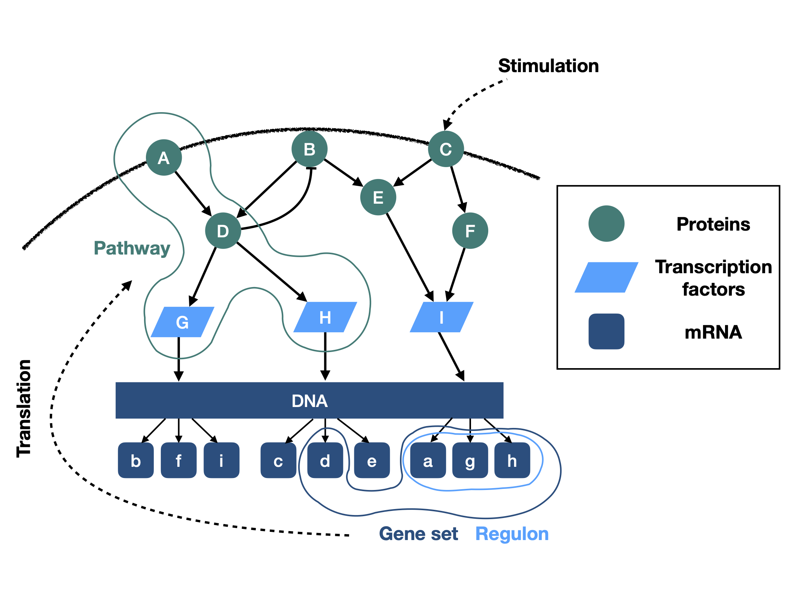

## Analysis code for: Why do pathway methods work better than they should?

Code repository for [Why do pathway methods work better than they should?](https://www.biorxiv.org/content/10.1101/2020.07.30.228296v1.abstract) on bioRxiv.

### Abstract
Different pathway analysis methods are frequently applied to cancer gene expression data to identify dysregulated pathways. In most cases these methods infer pathway activity changes based on the gene expression of pathway members. However, pathways are constituted by signaling proteins, and their activity - not their abundance - defines the activity of the pathway; the association between gene expression and protein activity is in turn limited and not well characterised. Other methods infer pathway activity from the expression of the genes whose transcription is regulated by the pathway of interest, which seems a more adequate proxy of activity. Despite these potential limitations, membership based pathway methods are frequently used and often provide statistically significant results.

Here, we submit that pathway based methods are not effective because of the correlation between the gene expression of pathway members and the activity of the pathway, but because pathway member gene sets overlap with the genes regulated by transcription factors (regulons). This implies that pathway methods do not inform about the activity of the pathway of interest, but instead the downstream effects of changes in the activities of transcription factors.

To support our hypothesis, we show that the higher the overlap to transcription factor regulons, the higher the information value of pathway gene sets. Furthermore, removing these overlapping genes reduces the information content of pathway gene sets, but not vice versa. Our results suggest that results of classical pathway analysis methods should be interpreted with caution, and instead methods using pathway regulated genes for activity inference should be prioritised.

### Description of notebooks
* **1\_data\_preprocessing\_and\_generation.ipynb**
* **2\_gene\_set\_similarity.ipynb**
* **3\_informative\_scores.ipynb** 
* **4\_informative\_vs\_similarity.ipynb**
* **5\_overlap\_removed.ipynb**

### Used libraries:

* [viper]()
* [msigdbR]()

 
